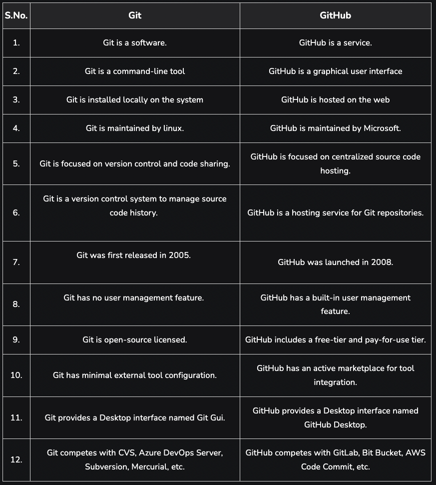

### GitHub

- The default branch name on VS code is `master` and on GitHub, it is `main`.
- To initialize, `git init`
- To create a new branch, `git branch -M main`.
- Add all the files: `git add .`
- Commit: `git commit -m "commit message"`.
- Adding a remote: `git remote add origin <remote-link>`.

#### Git vs GitHub



### NPM

- NPM isn't an abbreviation of `node package manager`.
- It is a tool used for package management and is the default package manager for Node projects. `NPM is installed when NodeJS` is installed on a machine. It comes with a command-line interface (CLI) used to interact with the online database of NPM. This database is called the NPM Registry, and it hosts public and private 'packages.' To add or update packages, we use the NPM CLI to interact with this database.
- `npm` alternative is `yarn`

- ```
  npm init
  ```
- `npm init -y` can be used to skip the setup step, `npm` takes care of it and creates the `package.json` json file automatically, but without configurations.

### Bundler

- `Parcel/Webpack` is a type of web application bundler used for development and production purposes or to power our application with different types of functionalities and features.
- It offers blazing-fast performance utilizing multicore processing and requires zero configuration. Parcel can take any type of file as an entry point, but an HTML or JavaScript file is a good place to start.
- **Parcel Features:**

  - HMR (Hot Module Replacement) - parcel keeps track of file changes via file watcher algorithm and renders the changes in the files
  - File watcher algorithm - made with C++
  - Minification
  - Cleaning our code
  - DEV and production Build
  - Super fast building algorithm
  - Image optimization
  - Caching while development => Faster Builds
  - Compress
  - Differential Bundling => Compatible with older versions of browsers
  - HTTPS support in dev env
  - Port Number
  - Consistent hashing algorithm
  - Zero Configuration
  - Automatic code splitting
  - Tree Shaking

- `Hot Module Replacement (HMR)` exchanges, adds, or removes modules while an application is running, without a full reload. This can significantly speed up development in a few ways: Retain application state lost during a full reload.

- ```
      npm install -D parcel
  ```
  `-D` is used to represent a development dependency.
- Parcel Commands :
  - For development build:
  ```
  npx parcel <entry_point>
  ```
  - For production build, usually takes longer than the development build:
  ```
  npx parcel build <entry_point>
  ```
- When required, remove `"main": "app.js"` from package.json file.

`5 superpowers of Parcel`:

- `HMR (Hot Module Replacement)` - adds, or removes modules while an application is running, without a full reload.
- `File watcher algorithm` - File Watchers monitor directories on the file system and perform specific actions when desired files appear.
- `Minification` - Minification is the process of minimizing code and markup in your web pages and script files.
- `Image optimization`
- `Caching while development`

#### `dependencies` vs `devDependencies`

- `Dependencies` should contain the library and framework on which your app is built and needs to function effectively, such as Vue, React, Angular, Express, JQuery and etc.
  `DevDependencies` should contain modules/packages a developer needs during development, such as `parcel, webpack, vite, mocha`.
  `These packages` are `necessary only in the development environment`, not necessary in the production environment.
  To save a dependency as a devDependency upon installation, we need to do:

```
npm install --save-dev
```

instead of just,

```
npm install --save
```

#### **~** or **^** in `package.json` file

These are used with the versions of the package installed.

For example, in `package.json` file:

```
"dependencies": {
    "react": "^18.2.0",
    "react-dom": "^18.2.0"
  }
```

- **~version** : `Approximately equivalent to version`, will update you to all future patch versions, without incrementing the minor version. `~1.2.3` will use releases from `1.2.3 to <1.3.0`.
- **^version** : `Compatible with version`, will update you to all future minor/patch versions, without incrementing the major version. `^1.2.3` will use releases from `1.2.3 to <2.0.0`.

> If none of them is present, that means only the version specified in `package.json` file is used in the development.

#### What is `.parcel-cache`?

`.parcel-cache` is used by parcel(bundler) to reduce the building time.
It stores information about your project when parcel builds it, so that when it rebuilds, it doesn't have to re-parse and re-analyze everything from scratch. It's a key reason why parcel can be so fast in development mode.

#### What is `npx`?

`npx` is a tool used to execute the packages. It comes with the npm. When you install npm above the `5.2.0` version, then `npx` will be installed automatically. It is an npm package runner that can execute any package that you want from the npm registry without even installing that package.

#### What is `Tree Shaking`?

`Tree shaking` is the process of removing the unwanted code that we do not use while developing the application.
In computing, tree shaking is a dead code elimination technique applied when optimizing code.

#### `.gitignore`

The `.gitignore file` is a text file that tells `Git` which files or folders to `ignore` in a project during `commit to the repository`.
The types of files you should consider adding to a .gitignore file are any files that do not need to get committed. For example, to maintain security, the security key files and API keys should get added to the gitignore.
`package-lock.json` should `not be added` into your `.gitignore` file. Anything that can be re-created should not be added to git.

The entries in this file can also follow a matching pattern.

```
* is used as a wildcard match
/ is used to ignore pathnames relative to the .gitignore file
# is used to add comments to a .gitignore file
```

This is an example of what the .gitignore file could look like:

```
# Ignore Mac system files
.DS_store

# Ignore node_modules folder
node_modules

# Ignore all text files
*.txt

# Ignore files related to API keys
.env

# Ignore SASS config files
.sass-cache
```

#### What is the difference between `package.json` and `package-lock.json`?

`package.json`:

- This file is mandatory for every project
- It contains basic information about the project
- Application name/version/scripts

`package-lock.json`:

- This file is automatically generated from those operations where npm modifies either the node_module tree or package.json.
- It is generated after an npm install
- It allows future devs & automated systems to download the same dependencies as the project.
- It also allows one to go back to the past version of the dependencies without actually committing the node_modules folder.
- It records the same version of the installed packages which allows to reinstall them.
  Future installs will be capable of building identical description tree.

- `package-lock.json` file contains information about the dependencies and their versions used in the project. Deleting it would cause dependencies issues in the production environment. So don't modify or delete it as it is being handled automatically by NPM.

#### What is `node_modules` ?

`node_modules` folder is like a cache for the external modules that your project depends upon. When you perform `npm install`, they are downloaded from the web and copied into the `node_modules` folder and Nodejs is trained to look for them there when you import them (without a specific path).

If you have the package.json file, running `npm i` can re-create the `node_modules` folder.

`Don't push node_modules` to github because it contains lots of files(more than 100 MB), it will cost you memory space.

#### What is the `dist` folder?

The `/dist` folder contains the minimized version of the source code. The code present in the `/dist` folder is the actual code which is used on production web applications. Along with the minified code, the `/dist` folder also comprises of all the compiled modules that may or may not be used with other systems.

#### What is `browserslist`?

`Browserslist` is a tool that allows specifying which browsers should be supported in your frontend app by specifying "queries" in a config file. It's used by frameworks/libraries such as React, Angular and Vue, but it's not limited to them.

#### What is `transitive dependency`?

When we install modules in our project folder, we get the node_modules folder, which contains the dependencies of the modules initially installed. Now, the dependencies in the node_modules folder may have their own dependencies (also present in the node_modules folder), and so on. This is known as `transitive dependencies`.

#### Why do we use `type="module"` in script tags?

If we need to perform any kind of imports/exports in our JS files, we need to use `type="module"` inside the script tag to specify that the file is a module. Else, it will be treated as a browser script and they are not allowed to have imports/exports.

#### React with CDN Links

It is not preferred to import react and react-dom with cdn links for many reasons. Firstly, the CDN links we use have the version of react in them. So, every time there is an update, we'd have to manually change the link which is tiresome and would also take time to get the data from the CDN link every time.

Instead, we can install react and react-dom via `npm` so that these are easily accessible from the node_modules folder.
