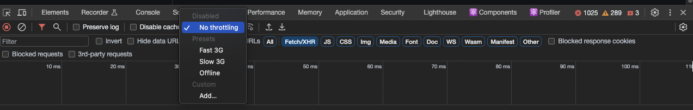

### Why is it `className` and not `class` in JSX?

Because `class` is a reserved word in JS.

### What is `SRP`?

`SRP` -> `Single Responsibility Principle`

Applying SRP means writing the code in such a manner where each component is responsible for a particular action. This introduces makes our code modular and reusable.

### What is `modularity`? Why is it needed?

In simple terms, `modularity` refers to creating separate components that can be reused. It is needed to make the code reusable, maintainable and testable.

### What are `hooks`? State some examples.

Hooks are simple JS utility/helper functions. Ex:

- `useState()`
- `useEffect()`
- `useParams()`, etc.

### `Hooks` vs regular functions?

The primary difference would be that regular JS functions can't access other hooks. Whereas, a `hook` is a function that can access other react hooks. Hooks are a way to interact with the react component lifecycle.

### What is a good convention to implement custom hooks?

Since, hooks are utility/helper functions, we can create a folder named `utils` and write the code to the custom hook in a file whose name begins with `use....js` within the `utils` folder.

`Note: It is only a convention to begin the name of hooks with use... and have the first alphabet of components capitalized. They would work otherwise too!`

### How to simulate `offline` status on the browser?

1. In the browser, right-click and select `Inspect`.
2. Go to the `Network` tab.
3. Select `Offline` in the drop-down
   

### How to check if a user is offline?

The browser gives us access to the `window object.` This `window object` has access to the `online` & `offline` events.

So, we can use the `addEventListener()` as in the ex below:

```sh
    window.addEventListener('online', () => {
        // required logic here...
    })

    window.addEventListener('offline', () => {
        // required logic here...
    })
```

### When and why do we need `lazy()`?

We need the `lazy()` when we want to perform `lazy loading`. It is provided by `React` so it needs to be imported from `react` when we want to use it.

Whichever component needs to lazy-loaded, it needs to be done as follows:

`const LazyComponent = lazy(() => import('./components/LazyComponent'));`

So, the `lazy()` takes in a callback function where we call the `import()`. This import is not the same as what we use to import other components regularly.

This needs to be complemented with `Suspense`.

### What is `Suspense`?

`Suspense` is a component that comes from `React`. We need to wrap the lazy loading component within the `Suspense` component.

`<Suspense fallback={}><LazyComponent /></Suspense>`

The fallback attribute takes in any JSX that is displayed to the user until the `LazyComponent` loads.

### Why we got this `error`: A component was suspended while responding to `synchronous input`. This will cause the `UI` to be replaced with a `loading indicator`. To `fix`, `updates that suspend` should be wrapped with `startTransition`? How does `suspense` fix this error?

This error occurs when we try to lazy load a component but don't handle it correctly using `Suspense`. When we lazy load a component, it takes some time to load on the browser and if this is longer than React's wait time, then we see this error.

This can be handled by using the `fallback` attribute in the `Suspense` component. This allows the browser to display content passed to `fallback` while the lazy component loads.

### `Advantages and Disadvantages` of using this `code splitting pattern`?

#### _Advantages of Code Splitting:_

- **Improved Initial Load Time:** Code splitting reduces the initial load time of your web application because only the essential code required to render the initial view is loaded. This results in faster page load times, which can lead to a better user experience.

- **Faster Time to Interactive:** By loading only what's necessary at the beginning, your web application can become interactive more quickly. Users can start interacting with your app sooner, even before all code is loaded.

- **Lower Bandwidth Usage:** Smaller initial downloads mean less data transfer, which is especially important for users on slower internet connections or mobile devices with limited data plans.

- **Optimized Caching:** Smaller code chunks are more likely to be cached by the browser. When users revisit your site, cached code can be reused, further improving load times.

- **Granular Updates:** With code splitting, you can update specific code chunks without affecting the entire application. This makes it easier to deploy updates and reduces the risk of introducing new bugs.

#### _Disadvantages of Code Splitting:_

- **Complexity:** Implementing code splitting can add complexity to your build process and codebase. You'll need to set up tools and configurations to manage code splitting effectively.

- **Initial Overhead:** While code splitting reduces the initial load time, it introduces some overhead because the browser must request and load additional code chunks as needed. This overhead can be minimal but is still present.

- **Routing and Navigation Complexity**: Code splitting can complicate client-side routing and navigation, especially in single-page applications (SPAs). You'll need to ensure that the correct code chunks are loaded when navigating between different routes.

- **Webpack Configuration:** If you're using Webpack for code splitting, configuring Webpack's dynamic imports and splitChunks plugin can be challenging for newcomers.

- **Potential for Over-Splitting:** Overzealous code splitting can lead to too many small code chunks, which can result in more HTTP requests and slower performance. Striking the right balance is important.

- **Compatibility Issues:** Older browsers and devices may not support code splitting or may require polyfills. Ensure that your target audience's browsers are compatible with the code splitting technique you choose.

### What is `logical separation`?

Say, we have a really huge app that we want to take to the production level. Since the app is really huge, even after bundling it, it may be big in size, resulting a slow load, causing a bad user experience.

To handle this, we need to break our code into smaller pieces for faster loading. We can use a `logical separation` to break the code such that each piece of code should provide one complete feature.

So, this means, chunking the code into multiple JS files, say based on feature, and load them as per requirement rather than having one big JS file or having mulitple JS files for each component.

Some other terms that represent this process:

- App Chunking
- Code Splitting
- Dynamic Bundling
- Lazy Loading
- on-Demand Loading
